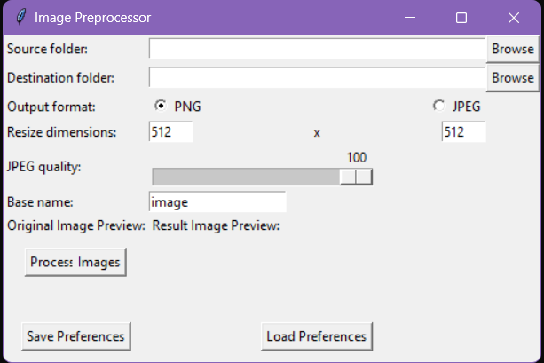

# EasyPrep: Easy Image Preprocessor

EasyPrep is a Python-based application built with Tkinter for handling basic image preprocessing tasks. This application allows users to resize images, convert image formats, adjust image quality, and perform batch image processing.

## Features

- Supports popular image formats (.png, .jpg, .jpeg, .gif, .bmp, .tiff, .tif)
- Resize images to desired dimensions
- Convert images to PNG or JPEG format
- Adjust the quality of JPEG images
- Previews for both the original image and the processed result
- Batch processing for multiple images
- Save and load user preferences

## Usage

1. Clone the repository: `git clone https://github.com/user/EasyPrep.git`
2. Run the script: `python3 image_preprocessor.py`
3. Browse and select source and destination folders for image processing.
4. Specify the output format, resize dimensions, JPEG quality, and base name for images.
5. Press "Process Images" to start the image preprocessing.
6. To save the current settings, click "Save Preferences". To load previously saved settings, click "Load Preferences".

## Dependencies

- Python 3
- PIL (Pillow)
- Tkinter
- configparser

## Contributions

Contributions, issues, and feature requests are welcome. Feel free to check issues page if you want to contribute.

## License

Distributed under the MIT [License](LICENSE).
